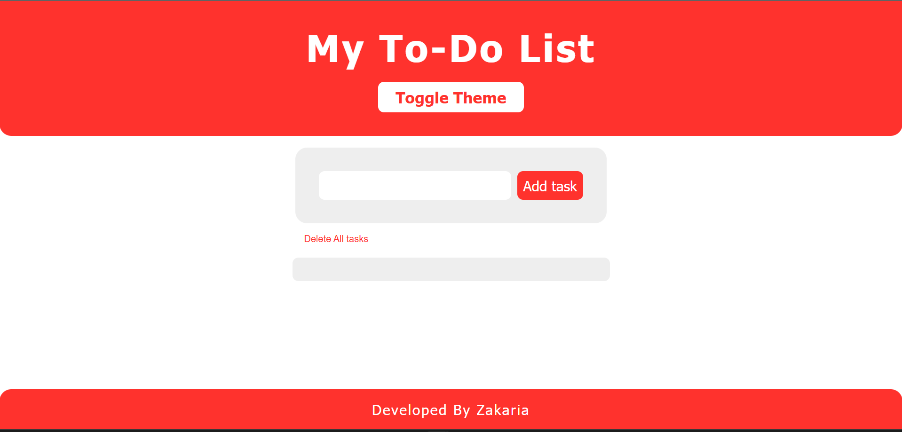

# To-Do List Web App

A simple, responsive, and themeable To-Do List application built with HTML, CSS, and JavaScript.  
You can add, complete, and delete tasks, switch between light and dark themes, and your tasks are saved in your browser.

## Features

- **Add Tasks:** Quickly add new tasks to your list.
- **Delete Tasks:** Remove individual tasks or clear all tasks at once.
- **Mark as Complete:** Click a task to mark it as completed.
- **Dark/Light Theme:** Toggle between dark and light mode. Your preference is saved.
- **Responsive Design:** Works great on desktop, tablet, and mobile screens.
- **Persistent Storage:** Tasks are saved in your browser's local storage.

## Demo

 <!-- Add a screenshot if you like -->

## Getting Started

1. **Clone the repository:**

   ```bash
   git clone https://github.com/ZakariaAlkaldi/To-Do-List.git
   cd To-Do-List
   ```

2. **Open the project:**
   - Open `index.html` in your web browser.

## Project Structure

```
.
├── index.html      # Main HTML file
├── style.css       # Styles for layout and themes
└── app.js          # JavaScript for interactivity and storage
```

## Usage

- Type a task in the input field and click **Add task**.
- Click a task to mark it as completed.
- Click **Delete** next to a task to remove it.
- Click **Delete All tasks** to clear the list.
- Use the **Toggle Theme** button to switch between light and dark mode.

## Credits

Developed By Zakaria

---

Feel free to fork, modify, and use this project!
